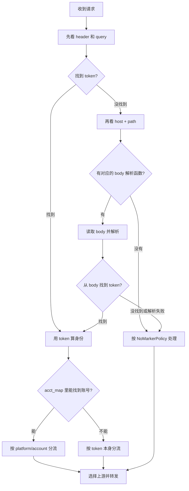

# 特殊请求的身份识别

## 要解决的问题

路由器现在主要从 header、query 里找 token。

但有些请求把 token 放在 body 里。Grok 刷新 token 就是这样：

```text
POST auth.x.ai/oauth2/token
Content-Type: application/x-www-form-urlencoded

client_id=...
grant_type=refresh_token
refresh_token=...
```

现在这个请求没有 header token，最后全部走 `default_session`。结果是所有账号刷新 token 都共用同一个上游会话。

目标：从 body 里的 `refresh_token` 得到身份。`acct_map` 里有该 token 时按账号分流；没有时也至少按 refresh token 分流，不要都落到 `default`。

---

## 处理顺序

顺序固定，不要让 body 规则抢在正常规则前面：



例如 OAuth 请求如果带了可识别的 `Authorization: Bearer ...`，header 已经命中，就不读 body。

Grok 的 token endpoint 通常没有 Bearer token，只有 form 里的 `refresh_token`，所以才会进入 body 解析。

---

## 特殊规则怎么加

代码里维护一个表：URL Key 对应一个解析函数。

```go
type BodyParser func(body []byte) (token string, ok bool)

type BodyRule struct {
    Host     string // 精确 host，避免相似域名误读 body
    PathKey  string // path 片段；不含 query
    Platform string
    Parse    BodyParser
}

var bodyRules = []BodyRule{
    {
        Host:     "auth.x.ai",
        PathKey:  "/oauth2/token",
        Platform: "grok",
        Parse:    parseGrokRefreshToken,
    },
}
```

匹配方式：

```text
请求实际地址：auth.x.ai/oauth2/token?foo=bar
用于匹配的值：auth.x.ai/oauth2/token
不参与匹配：?foo=bar
```

`Host` 必须精确匹配；`PathKey` 不一定是完整 path，但要足够唯一。

如果同一 Host 下多个 PathKey 都命中，选更长的那个。例如：

```text
Host: auth.x.ai
PathKey: /oauth2
PathKey: /oauth2/token
```

请求 `/oauth2/token` 时选第二条。`evil-auth.x.ai` 即使 path 相同也不会命中。

每新增一种特殊请求，只需要：

1. 新增一个 `parseXXX` 函数；
2. 在表里加一条 URL Key；
3. 为这个函数加测试。

不要继续在 `server.forward` 里加平台判断。

---

## 读 body 的规则

URL 命中后就直接读 body，不需要绕开这个动作。

读取上限先固定为：

```text
64 KiB
```

Grok 已抓到的 OAuth body 约为 172 字节，远小于这个限制。

读 body 后必须把原样内容重新放回 `r.Body`：

```go
raw := readBodyWithLimit(r.Body, 64<<10)
r.Body = io.NopCloser(bytes.NewReader(raw))
```

这样后面的转发仍能把同一份 body 发给目标站。

处理原则：

| 情况 | 怎么做 |
|---|---|
| URL 没命中规则 | 不读 body |
| body 不超过 64 KiB | 读、解析、再放回 `r.Body` |
| body 超过 64 KiB | 不解析，但请求必须继续完整转发 |
| form/JSON 格式错误 | 不解析，继续原来的回退逻辑 |
| 找不到目标字段 | 不解析，继续原来的回退逻辑 |

body 解析失败不能影响请求本身。

---

## 第一条规则：Grok OAuth

```go
func parseGrokRefreshToken(body []byte) (string, bool) {
    form, err := url.ParseQuery(string(body))
    if err != nil {
        return "", false
    }
    token := form.Get("refresh_token")
    return token, token != ""
}
```

完整行为：

```text
POST auth.x.ai/oauth2/token
→ 没有 header/query token
→ URL 命中 grok parser
→ 从 form 取 refresh_token
→ 查 acct_map("grok", refresh_token)
   ├─ 命中：按 grok/account 分流
   └─ 未命中：按 refresh_token 分流
```

因此 refresh token 尚未同步到账号映射表时，也不会再全部使用 `default`。

---

## 安全要求

绝不记录：

```text
refresh_token
access_token
Authorization 值
完整 body
query 参数值
密码
```

允许记录：

```text
命中的 URL Key
body 长度
Content-Type
字段名
字段长度
解析成功/失败/超限
```

例如：

```text
rule=grok.oauth.refresh
result=credential
body_bytes=172
fields=client_id,grant_type,refresh_token
```

---

## 要测什么

1. 有 header token 时，不读 body；
2. Grok form 能取到 `refresh_token`；
3. 读 body 前后，下游收到的 body 字节完全相同；
4. 相同 refresh token 得到相同身份；
5. 不同 refresh token 得到不同身份；
6. `acct_map` 命中时按账号分流；
7. 超限、坏 form、没有 `refresh_token` 时正常转发并回退；
8. 日志、审计、指标里没有测试 token 原文。

---

## 实现位置

新增：

```text
internal/identity/
```

里面放：

```text
resolver.go    先 header/query/Marker，再 body rule
body.go        读 body、限制大小、恢复 r.Body
parsers.go     URL Key 表和各 parseXXX 函数
```

`server.forward` 最后只保留一件事：

```go
identity := resolver.Resolve(r, host)
```
